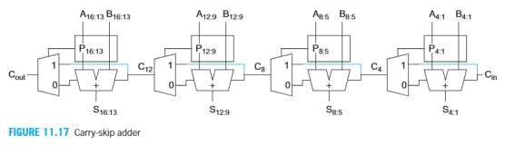
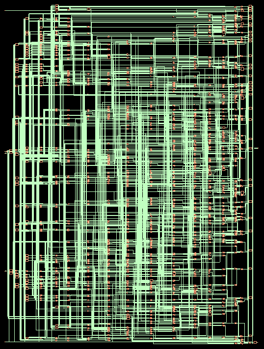
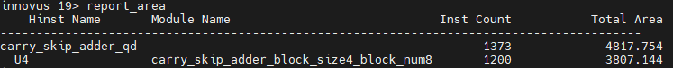
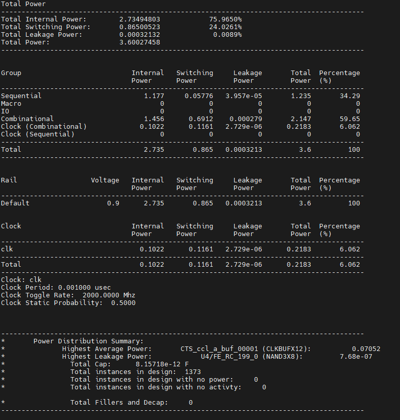
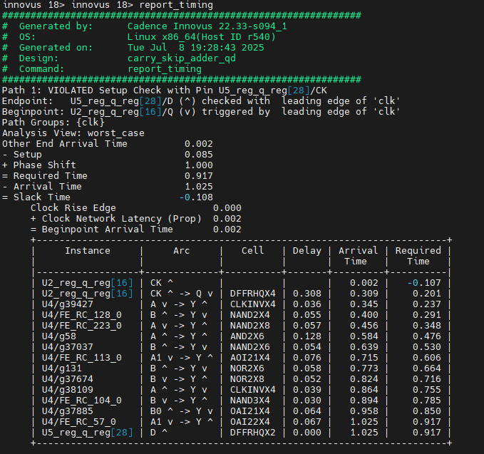
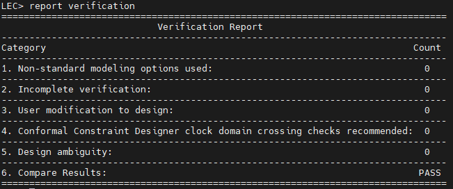

# 32-bit Parametric Carry-Skip Adder (VHDL) & Synthesis Analysis

## Project Overview

This project explores the design space of a **32-bit Carry-Skip Adder** (CSA) using VHDL. The goal was to implement a <ins>parametric design</ins> allowing for variable block sizes of the grouped propagate logic (e.g., 8 blocks of 4 bits, 4 blocks of 8 bits) and analyze the impact on Critical Path Delay and Area.

**Key Tools Used:**

* **RTL Design:** VHDL

* **Synthesis:** Cadence Genus (45nm & 7nm libraries)

* **Physical Implementation:** Cadence Innovus

* **Verification:** Mentor Graphics ModelSim & Cadence LEC (Logic Equivalence Check)

## Architecture

The design utilizes a `generic` based VHDL architecture to dynamically generate skip-logic blocks based on user parameters.

## Key Engineering Insight: Tool Optimization

We implemented multiple configurations to find the optimal block sizing for delay minimization:

* 1 block of 32 bits (Standard Ripple Carry Adder)

* 2 blocks of 16 bits

* 4 blocks of 8 bits

* 8 blocks of 4 bits

* 16 blocks of 2 bits

* 32 blocks of 1 bit

**Finding:** Detailed analysis using **Cadence Genus** revealed that modern synthesis tools perform aggressive logic restructuring. Except for the baseline RCA, **all grouped configurations resulted in identical netlists** regarding PPA (Power, Performance, Area).

This demonstrates that for standard arithmetic architectures, the synthesis tool's optimization algorithms (boundary optimization & retiming) often override manual RTL grouping strategies at the standard cell level.

## Implementation Results (Genus 45nm)

### 1. Schematic View

Synthesized netlist visualization showing the complexity of the skip logic of the standard RCA

### 2. Physical Implementation (Innovus)

Post-route analysis confirmed the timing closure and power consumption.

### 3. Formal Verification (LEC)

To ensure the synthesis optimizations did not alter the functionality, we performed **Logic Equivalence Checking (LEC)** between the RTL and the Synthesized Netlist.

**Result: PASS**

